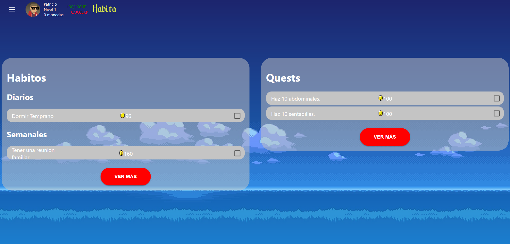
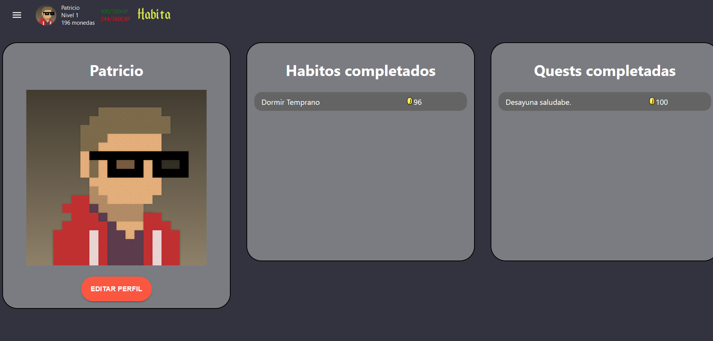
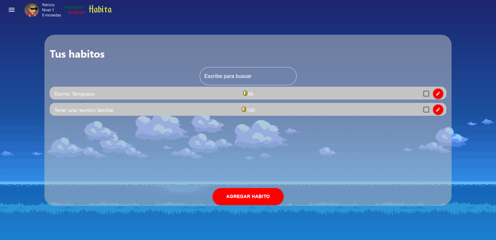
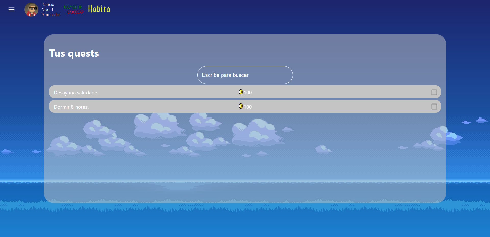

# Habita App
Página Web para crear nuevos hábitos, y llevar control de ellos, mejorarando el estilo de vida.

<h2> 
   
  Front end 
</h2>

Desarrollamos el Front de Habita con el framework React.js usando Typescript como lenguaje principal.

<h2> 
   
  Back end  
</h2>
Desarrollamos el servidor usando Node.js con Express.js
<h2> 
   
  Bases de Datos  
</h2>
Utilizamos un esquema en mongo.

<h2> 
    Objetivo
</h2>

El sistema tiene como objetivo facilitar a las personas una manera de poder llevar el registro de sus hábitos de una manera gameficada.

<h2>
Pantallas
</h2>

<h3> 
Inicio de sesión
</h3>
  
<h3> 
  Esta pantalla tiene como funcionalidad el inicio de sesión, el usuario deberá de ingresar su correo con el que registró a la página y su contraseña.
Registro
</h3>
  
<h3> 
  Esta pantalla se utiliza para registrar a un usuario en nuestra página web, el usuario deberá de ingresar sus datos como el nombre, correo electrónico y contraseña.
Dashboard
</h3>
  
<h3> 
La página inicial se redirige al tablero, en donde el usuario puede marcar sus hábitos como completados al igual que las misiones auto generadas.
Perfil
</h3>
  
<h3> 
Hábitos
</h3>
  
<h3> 
Quests
</h3>
  
 
<h2>
Creado Por
</h2>

<ul>
    <li>
    David Alonso Cantú Martínez A00822455
    </li>
    <li>
    Patricio Andres Saldivar Flores A01282504
    </li>
    <li>
    Luis Felipe Alvarez Sanchez A01194173
    </li>
</ul>

